<p align="center"></p>

# @git-fabric/terminal

Claude Code + tmux + kubectl in a persistent container.

Accessible via `kubectl exec` or Tailscale SSH sidecar.
Runs entirely as uid 1000 — no privilege escalation required.

## Usage

```bash
# Attach to the tmux session
kubectl exec -it -n cortex-system deployment/fabric-terminal -- tmux new-session -A -s main

# Or via Tailscale (if sidecar configured)
ssh fabric@cortex-terminal
```

## Environment

| Variable | Required | Description |
|---|---|---|
| `ANTHROPIC_API_KEY` | Yes | Claude API key for Claude Code |

## Image

`ghcr.io/git-fabric/terminal:latest`

<!-- org-footer -->
---

<p align="center"><sub>Part of <a href="https://github.com/git-fabric">git-fabric</a> · composable fabric apps for Git-native infrastructure · built by <a href="https://github.com/ry-ops">ry-ops</a></sub></p>
